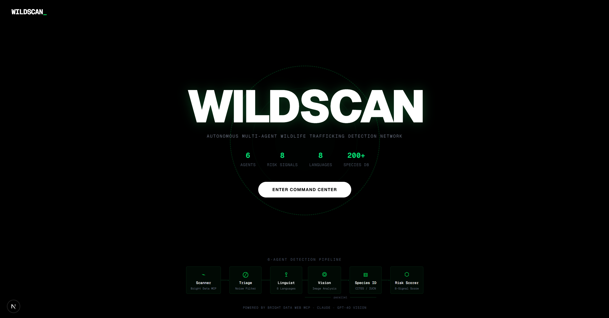
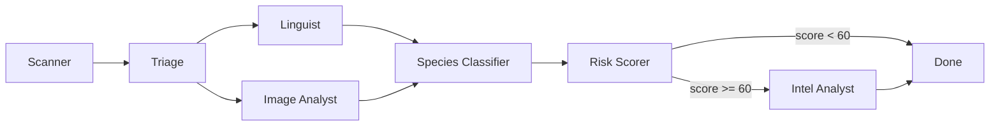
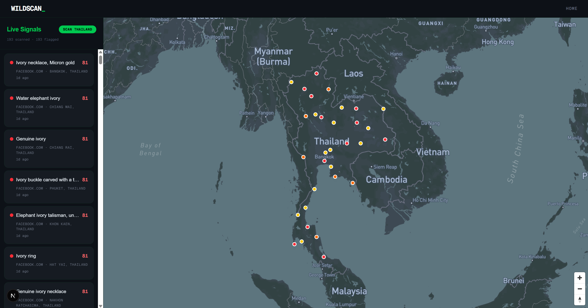
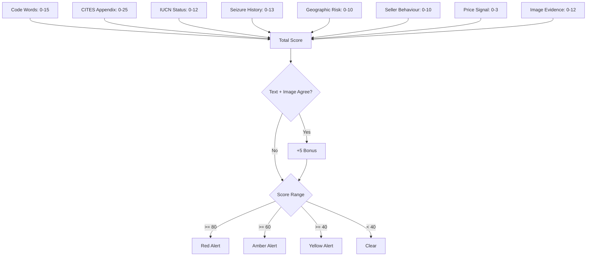

# WILDSCAN

**Autonomous multi-agent system for detecting wildlife trafficking on online marketplaces.**

Built in 90 minutes and winner of the [Unicorn Mafia x Techbible Hack Night](https://luma.com/etljlw2n) (Web MCP Agents track, March 2026, London).

Wildlife trafficking is a $23 billion criminal enterprise. It operates openly on regional marketplaces like Facebook Marketplace, OLX Thailand, Cho Tot, and Shopee. Sellers post in local languages using code words and euphemisms to disguise illegal ivory, pangolin scales, rhino horn, and other protected species products. Law enforcement monitors these platforms manually, one listing at a time.

WILDSCAN automates the entire detection chain: scraping, translation, code word matching, species identification, risk scoring, and intelligence brief generation. No human in the loop.

The landing page shows the 6-agent pipeline and key system stats. Click "Enter Command Center" to start scanning.



## How It Works

Six AI agents run as a LangGraph state machine. Each agent does one thing. Listings flow through the chain and come out scored, classified, and ready for investigators.



### Agents

**Scanner** connects to Bright Data's Web MCP server over stdio. Bright Data provides geo-proxied access to regional marketplaces that block foreign IPs. Thai OLX, Vietnamese Cho Tot, Facebook Marketplace Thailand are all inaccessible from a UK or US connection without it. The scanner pulls raw HTML, normalises every listing into a consistent schema, downloads product images, and deduplicates by content hash.

**Triage** is fully deterministic. No LLM calls. It runs regex code word scans against listing titles and checks seller profiles (account age, listing count, high-risk category flags). This filters out 70-80% of irrelevant listings before a single token is spent.

**Linguist** and **Image Analyst** run in parallel. The Linguist matches listing text against a 500-term code word lexicon covering 8 languages. It handles exact matches, fuzzy matches (via rapidfuzz), and obfuscation tricks like zero-width characters or letter substitutions. For ambiguous hits in the 0.3-0.7 confidence range, it calls Claude for a judgment call. GPT-4o handles translation to English. The Image Analyst sends product photos to GPT-4o Vision, which classifies them against known wildlife product categories: ivory, pangolin scales, rhino horn, tiger parts, tortoiseshell, shahtoosh wool, bear bile, coral, shark fin, hornbill casque, and more.

**Species Classifier** takes the text and image results and cross-references them against real databases. It queries CITES (the international wildlife trade treaty) for appendix level and trade suspension status. It checks the IUCN Red List for conservation status. It compares the seller's country against the species' natural range. And it pulls matching records from 6,000 historical seizure incidents to find trafficking pattern correlations.

**Risk Scorer** is deterministic. It computes a total score from 0-100 using 8 weighted signals:

| Signal | Max Points |
|--------|-----------|
| Code word confidence | 15 |
| CITES appendix | 25 |
| IUCN conservation status | 12 |
| Seizure correlation | 13 |
| Geographic risk | 10 |
| Seller behaviour | 10 |
| Price signal | 3 |
| Image evidence | 12 |

A +5 bonus applies when text and image analyses agree on the same species. Hard overrides force a minimum score for active CITES trade suspensions. Score >= 80 is red, >= 60 amber, >= 40 yellow, below 40 clear.

**Intel Analyst** triggers only for red and amber tier detections. Claude generates a structured intelligence brief containing an executive summary, legal framework, key evidence, species profile, and recommended actions for investigators.

## Command Center

The command center is the operational interface. On the left is the detection list. In the center is a Mapbox GL globe. On the right, detection details appear when you select a listing.

Before scanning, the globe is empty. The sidebar prompts you to start surveillance on a target region.


After clicking "Scan Thailand", the system scrapes Facebook Marketplace Thailand through Bright Data, runs all 6 agents, and plots results on the map. Each dot is a flagged listing. Red dots are high-risk (score 80+), amber dots are medium-risk (60-79), yellow dots are lower confidence (40-59).

In this scan, 193 listings were processed and 193 were flagged. The sidebar shows each detection with its title, platform, location, and risk score. Detections are spread across Thailand from Chiang Rai in the north to Hat Yai in the south.



Clicking a detection opens the detail panel on the right. This example shows "Genuine ivory" from Facebook Marketplace in Chiang Rai, Thailand. It scored 81/100 (Red Alert). The signal breakdown shows exactly where those points came from: 15/15 on code words, 25/25 on CITES (Appendix I), 10/12 on IUCN status, 8/13 on seizure correlation, 6/10 on geographic risk, and 12/12 on image evidence. Below that, the detected Thai code word is shown with its confidence level. The geographic risk section flags that legal trade is not possible and references prior seizures in the region. At the bottom, the intelligence brief and a chat interface let investigators ask follow-up questions about the case.


## Risk Scoring



## Data Sources

The system relies on a structured data backbone instead of LLM guesswork. LLMs confirm and fill gaps. They don't make the decisions.

**Species Reference Database** contains CITES appendix levels, IUCN conservation statuses, range countries, trade suspension flags, and local names for 200+ protected species. Sourced from the Species+ Checklist API and IUCN Red List API.

**Code Word Lexicon** has 500 entries across 8 languages (Thai, Vietnamese, Mandarin, Bahasa Indonesia, Burmese, Filipino, Afrikaans, English). Each entry includes exact match terms, fuzzy variants, obfuscation patterns, false-positive exclusion contexts, and required co-occurring terms. This dataset does not exist publicly.

**Seizure Records** contain 6,000 historical trafficking incidents extracted from UNODC and TRAFFIC reports. Each record has source, destination, and transit countries, product type, quantity, and date. Stored with PostGIS geometry for geographic queries.

**Trafficking Routes** are pre-computed GeoJSON line strings based on UNODC corridor data, rendered on the globe.

## Tech Stack

**Backend:** Python 3.12, FastAPI, LangGraph, SQLAlchemy 2.0 (async), asyncpg, GeoAlchemy2

**Frontend:** Next.js 16, React 19, TypeScript, Mapbox GL, Tailwind CSS 4

**Database:** PostgreSQL 16 + PostGIS 3.4

**AI:** GPT-4o (translation, image vision), Claude Sonnet (linguistic analysis, intelligence briefs), Bright Data Web MCP (geo-proxied scraping)

**Infrastructure:** Docker Compose (3 services: db, backend, frontend)

## API

| Method | Endpoint | Description |
|--------|----------|-------------|
| GET | `/api/globe` | Globe data (detection points + trafficking routes) |
| GET | `/api/detections` | Paginated detection list with filters |
| GET | `/api/detections/stats` | Risk tier distribution counts |
| GET | `/api/detections/{id}` | Full detection detail with brief |
| POST | `/api/scan/start` | Trigger a new marketplace scan |
| POST | `/api/intel/brief/{id}` | Generate intelligence brief |
| POST | `/api/intel/chat` | Streaming chat about a detection |
| GET | `/api/species` | Species lookup |
| GET | `/api/lexicon` | Code word lexicon browser |
| POST | `/api/feedback` | Investigator feedback (false positive tagging) |
| WS | `/api/detections/ws` | Real-time detection stream during scans |

## Getting Started

### Prerequisites

- Docker and Docker Compose
- API keys for OpenAI, Anthropic, Bright Data, and Mapbox

### Setup

1. Clone the repo:
```bash
git clone https://github.com/omorros/WILDSCAN.git
cd WILDSCAN
```

2. Create a `.env` file in the project root:
```
DATABASE_URL=postgresql+asyncpg://wildscan:wildscan@db:5432/wildscan
OPENAI_API_KEY=your-key
ANTHROPIC_API_KEY=your-key
BRIGHT_DATA_API_TOKEN=your-token
CORS_ORIGINS=http://localhost:3000
```

3. Start the services:
```bash
docker compose up --build
```

This starts PostgreSQL with PostGIS on port 5555, the FastAPI backend on port 8000, and the Next.js frontend on port 3000. Database migrations run automatically on first boot.

4. Open `http://localhost:3000`

### Running Without Docker

Backend:
```bash
pip install -r requirements.txt
uvicorn backend.main:app --reload --port 8000
```

Frontend:
```bash
cd frontend
npm install
npm run dev
```

Requires a running PostgreSQL instance with PostGIS. Update `DATABASE_URL` in `.env` accordingly.

## Project Structure

```
WILDSCAN/
  backend/
    agents/          # LangGraph pipeline (6 agents + graph + state)
    api/             # FastAPI route handlers
    services/        # Bright Data MCP client, database session
    config.py        # Settings from environment
    main.py          # FastAPI app entry point
  frontend/
    app/             # Next.js pages (landing, search/command center)
    components/      # Globe, detection list, signal breakdown, chat
  migrations/        # SQL files (schema, species, code words, seizures, routes)
  docker-compose.yml
  Dockerfile
  requirements.txt
```

## License

MIT
