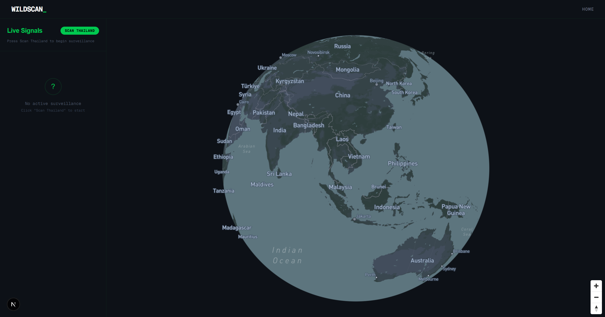
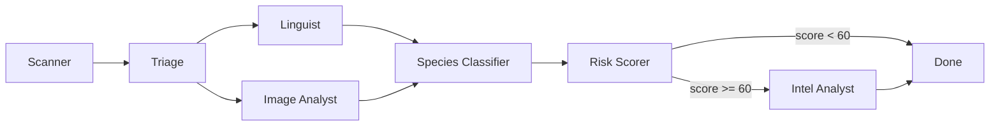
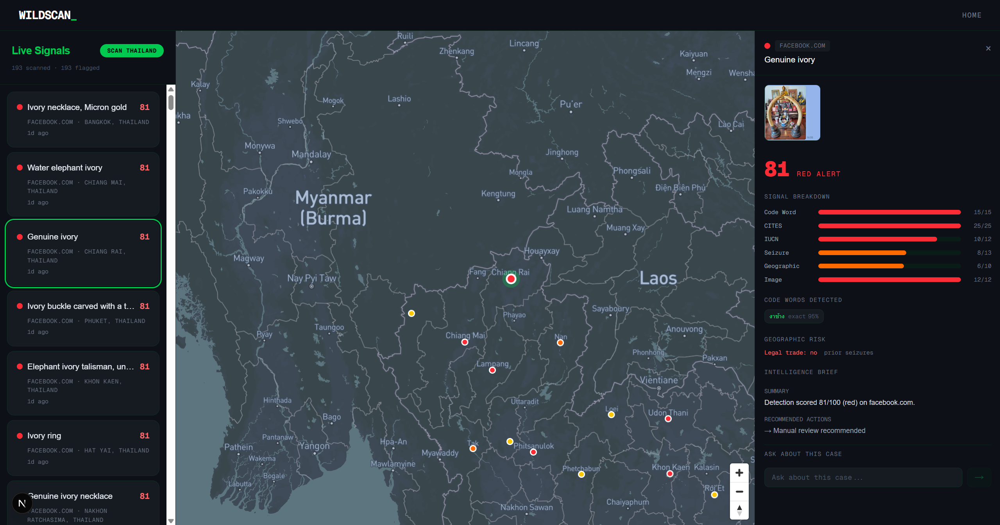
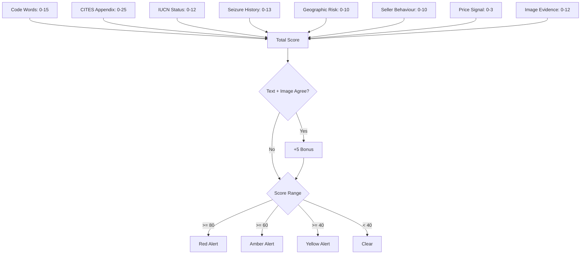

# WILDSCAN

**Autonomous multi-agent system for detecting wildlife trafficking on online marketplaces.**

Winner of the [Unicorn Mafia x Techbible Hack Night](https://luma.com/etljlw2n) (Web MCP Agents track, March 2026).

Wildlife trafficking is a $23 billion criminal enterprise operating openly on regional marketplaces like OLX Thailand, Cho Tot, Shopee, and Facebook Marketplace. Listings are posted in local languages using code words and euphemisms to hide illegal ivory, pangolin scales, rhino horn, and other protected species products. WILDSCAN finds them automatically.



## How It Works

Six AI agents run as a LangGraph pipeline. Each agent has one job. Listings flow through the chain and come out the other end scored, classified, and ready for investigators.



### Agents

**Scanner** scrapes marketplace HTML through Bright Data's Web MCP server. Geo-proxied access lets us reach Thai, Vietnamese, and Indonesian marketplaces that block foreign IPs. Listings are normalised into a consistent schema, images are downloaded, and duplicates are filtered by content hash.

**Triage** is fully deterministic. No LLM calls. It runs regex code word scans and checks seller profiles (account age, listing count, category risk). Filters out 70-80% of irrelevant listings before any tokens are spent.

**Linguist** and **Image Analyst** run in parallel. The Linguist matches listing text against a 500-term code word lexicon covering 8 languages, handles fuzzy matches and obfuscation tricks, then calls GPT-4o for translation and Claude for ambiguous cases. The Image Analyst sends product photos to GPT-4o Vision to classify wildlife products (ivory, pangolin scales, rhino horn, tiger parts, tortoiseshell, shark fin, and more).

**Species Classifier** cross-references text and image detections against CITES (international trade treaty) and IUCN Red List databases. It checks whether the seller's country falls within the species' natural range and pulls matching seizure records from historical data.

**Risk Scorer** is deterministic. It computes a score from 0-100 using 8 weighted signals:

| Signal | Max Points |
|--------|-----------|
| Code word confidence | 15 |
| CITES appendix | 25 |
| IUCN conservation status | 12 |
| Seizure correlation | 13 |
| Geographic risk | 10 |
| Seller behaviour | 10 |
| Price signal | 3 |
| Image evidence | 12 |

A +5 bonus applies when text and image analyses agree. Hard overrides kick in for active CITES trade suspensions. Score >= 80 is red, >= 60 amber, >= 40 yellow, below 40 clear.

**Intel Analyst** triggers for red and amber detections. Claude generates a structured intelligence brief with executive summary, legal framework, evidence breakdown, species profile, and recommended actions.



## Risk Scoring



## Data Sources

The system relies on a structured data backbone rather than LLM guesswork.

**Species Reference Database** contains CITES appendix levels, IUCN conservation statuses, range countries, trade suspension flags, and local names for 200+ protected species. Sourced from the Species+ Checklist API and IUCN Red List API.

**Code Word Lexicon** has 500 entries across 8 languages (Thai, Vietnamese, Mandarin, Bahasa Indonesia, Burmese, Filipino, Afrikaans, English). Each entry includes exact match terms, fuzzy variants, obfuscation patterns, false-positive contexts, and required co-occurring terms. This dataset does not exist publicly.

**Seizure Records** contain 6,000 historical trafficking incidents extracted from UNODC and TRAFFIC reports. Each record includes source/destination/transit countries, product type, quantity, and date. Stored with PostGIS geometry for geographic queries.

**Trafficking Routes** are pre-computed GeoJSON line strings from UNODC corridor data, rendered on the globe visualization.

## Tech Stack

**Backend:** Python 3.12, FastAPI, LangGraph, SQLAlchemy 2.0 (async), asyncpg, GeoAlchemy2

**Frontend:** Next.js 16, React 19, TypeScript, Mapbox GL, Tailwind CSS 4

**Database:** PostgreSQL 16 + PostGIS 3.4

**AI:** GPT-4o (translation, image vision), Claude Sonnet (linguistic analysis, intelligence briefs), Bright Data Web MCP (geo-proxied scraping)

**Infrastructure:** Docker Compose (3 services: db, backend, frontend)

## API

| Method | Endpoint | Description |
|--------|----------|-------------|
| GET | `/api/globe` | Globe data (detection points + trafficking routes) |
| GET | `/api/detections` | Paginated detection list with filters |
| GET | `/api/detections/stats` | Risk tier distribution counts |
| GET | `/api/detections/{id}` | Full detection detail with brief |
| POST | `/api/scan/start` | Trigger a new marketplace scan |
| POST | `/api/intel/brief/{id}` | Generate intelligence brief |
| POST | `/api/intel/chat` | Streaming chat about a detection |
| GET | `/api/species` | Species lookup |
| GET | `/api/lexicon` | Code word lexicon browser |
| POST | `/api/feedback` | Investigator feedback (false positive tagging) |
| WS | `/api/detections/ws` | Real-time detection stream during scans |

## Getting Started

### Prerequisites

- Docker and Docker Compose
- API keys for OpenAI, Anthropic, Bright Data, and Mapbox

### Setup

1. Clone the repo:
```bash
git clone https://github.com/omorros/WILDSCAN.git
cd WILDSCAN
```

2. Create a `.env` file in the project root:
```
DATABASE_URL=postgresql+asyncpg://wildscan:wildscan@db:5432/wildscan
OPENAI_API_KEY=your-key
ANTHROPIC_API_KEY=your-key
BRIGHT_DATA_API_TOKEN=your-token
CORS_ORIGINS=http://localhost:3000
```

3. Start the services:
```bash
docker compose up --build
```

This starts PostgreSQL with PostGIS on port 5555, the FastAPI backend on port 8000, and the Next.js frontend on port 3000. Database migrations run automatically on first boot.

4. Open `http://localhost:3000`

### Running Without Docker

Backend:
```bash
pip install -r requirements.txt
uvicorn backend.main:app --reload --port 8000
```

Frontend:
```bash
cd frontend
npm install
npm run dev
```

Requires a running PostgreSQL instance with PostGIS. Update `DATABASE_URL` in `.env` accordingly.

## Project Structure

```
WILDSCAN/
  backend/
    agents/          # LangGraph pipeline (6 agents + graph + state)
    api/             # FastAPI route handlers
    services/        # Bright Data MCP client, database session
    config.py        # Settings from environment
    main.py          # FastAPI app entry point
  frontend/
    app/             # Next.js pages (landing, search/command center)
    components/      # Globe, detection list, signal breakdown, chat
  migrations/        # SQL files (schema, species, code words, seizures, routes)
  docker-compose.yml
  Dockerfile
  requirements.txt
```

## Screenshots


## License

MIT
